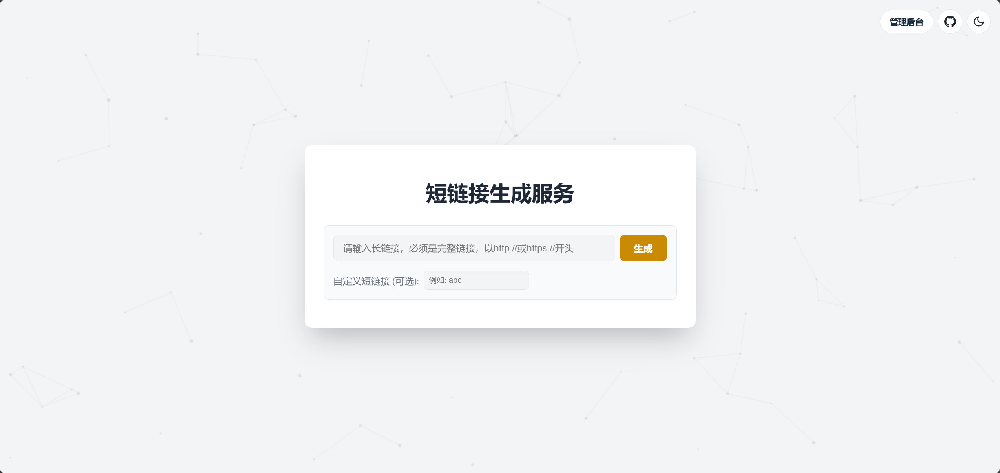

# 📦 Edgeone‑ShortURL

基于 **腾讯云 EdgeOne Pages** 构建的无服务器短链接服务（URL Shortener）。支持快速创建短链接、访问统计和简易管理后台，适合部署在 EdgeOne 平台并自定义域名使用。

---

## 🚀 特性

✨ Edgeone‑ShortURL 支持：

- 🔗 **短链生成**：自动生成随机短链接，也支持自定义短链标识（slug）。
- 📊 **访问统计**：支持查看每个短链接的访问次数。
- 🧠 **管理界面**：简洁的 Web 控制台用于创建/管理短链接。
- 🚀 **无服务器架构**：基于 EdgeOne Functions 实现，具有低延迟和高可用性。
- ⚙️ **简单部署**：依赖 EdgeOne Pages，流程简单，无需额外服务器。

---

## 📸 预览

---

## 🧩 安装与部署

### 📍 1. Fork 并部署到 EdgeOne Pages

1. Fork 本仓库到你的 GitHub 帐号。
2. 在 EdgeOne Pages 控制台中绑定该 GitHub 仓库，或者点击下方按钮一键部署。
3. 完成自动构建与部署。
   
（国内版）

（国际版）

---

### 🗄️ 2. 绑定 KV 存储

1. 在 EdgeOne 控制台打开你的 Pages 项目。
2. 进入 **设置 -> KV 存储** 创建一个 namespace。
3. 设置绑定名，如：`MY_KV`。
4. 重新部署项目。

---

### 🔧 3. 设置环境变量（可选）

| 变量名        | 作用说明                            |
|---------------|-------------------------------------|
| `ADMIN_PATH`  | 自定义后台路径（如：`admin123`） |
| `PASSWORD`    | 后台访问密码                        |

---

## 🧠 使用方法

### 🛠 管理后台

1. 打开部署后网站访问首页。
2. 输入长链接并点击 **创建短链接**。
3. 后台可查看所有短链记录。

### 🔗 使用短链接

访问生成的短链接即可跳转到原始长链接。

---

## 📡 API 接口说明

| 接口               | 方法   | 说明               |
|--------------------|--------|--------------------|
| `/api/create`      | POST   | 创建短链接         |
| `/api/links`       | GET    | 获取短链接列表     |
| `/api/delete`      | DELETE | 删除短链接         |

---

## 🛡️ 致谢

项目灵感来自 [**hobk的eo-short**](https://github.com/hobk/eo-short)，感谢其开源贡献。

---

## 📃 License

本项目使用 **MIT License**。

---

如果这个插件对你有帮助，欢迎在 GitHub 上点一个 ⭐ 支持作者！
