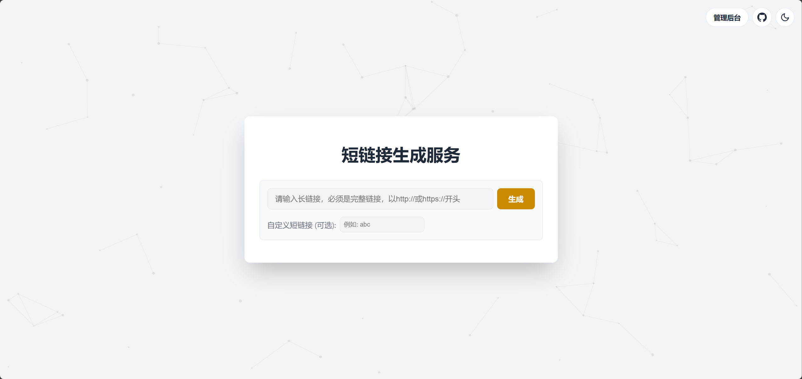

# 📦 Edgeone‑ShortURL

基于 **腾讯云 EdgeOne Pages** 构建的无服务器短链接服务（URL Shortener）。支持快速创建短链接、访问统计和简易管理后台，适合部署在 EdgeOne 平台并自定义域名使用。

**🔒 安全加固版本 v2.1.0** - 已实施企业级安全措施

---

## 🚀 特性

✨ Edgeone‑ShortURL 支持：

- 🔗 **短链生成**：自动生成随机短链接，也支持自定义短链标识（slug）。
- 📊 **访问统计**：支持查看每个短链接的访问次数。
- 🧠 **管理界面**：简洁的 Web 控制台用于创建/管理短链接。
- 🚀 **无服务器架构**：基于 EdgeOne Functions 实现，具有低延迟和高可用性。
- ⚙️ **简单部署**：依赖 EdgeOne Pages，流程简单，无需额外服务器。
- 🔒 **企业级安全**：会话令牌认证、速率限制、CSRF保护、URL黑名单、审计日志

---

## 🔒 安全特性（v2.1.0 新增）

✅ **会话令牌认证** - 安全的UUID会话令牌替代密码哈希  
✅ **速率限制** - 防止暴力破解和API滥用  
✅ **CSRF保护** - 防止跨站请求伪造攻击  
✅ **URL黑名单** - 阻止恶意URL和钓鱼链接  
✅ **审计日志** - 记录所有关键操作（保留7天）  
✅ **安全Cookie** - HttpOnly、Secure、SameSite=Strict  
✅ **输入验证** - 严格的slug和URL格式验证  

详见 [SECURITY.md](SECURITY.md) 了解完整安全文档。

---

## 📸 预览



---

## 🧩 安装与部署

### 📍 1. Fork 并部署到 EdgeOne Pages

1. Fork 本仓库到你的 GitHub 帐号。
2. 在 EdgeOne Pages 控制台中绑定该 GitHub 仓库，或者点击下方按钮一键部署。
3. 完成自动构建与部署。
   
[](https://console.cloud.tencent.com/edgeone/pages/new?repository-url=https%3A%2F%2Fgithub.com%2Fhobk%2Feo-short%2F)（国内版）

[](https://edgeone.ai/pages/new?repository-url=https%3A%2F%2Fgithub.com%2Fhobk%2Feo-short%2F)（国际版）

---

### 🗄️ 2. 绑定 KV 存储

1. 在 EdgeOne 控制台打开你的 Pages 项目。
2. 进入 **设置 → KV 存储**，创建一个命名空间（namespace）。
3. 设置绑定变量名为：`my_kv`。
4. 重新部署项目。

---

### 🔧 3. 设置环境变量（强烈推荐）

| 变量名        | 作用说明                            | 安全建议 |
|---------------|-------------------------------------|----------|
| `ADMIN_PATH`  | 自定义后台路径（如：`admin_xyz_789`） | 使用随机字符串，避免使用`admin`等常见路径 |
| `PASSWORD`    | 后台访问密码                        | 使用强密码（≥16字符，包含大小写字母、数字、特殊字符） |

**⚠️ 安全提示**：
- 不设置密码将允许任何人访问管理后台！
- 推荐密码示例：`9K#mP$2vL@8xQ!wE`
- 避免使用弱密码如：`admin123`、`password`

---

## 🧠 使用方法

### 📖 使用流程

1. 打开部署后的网站地址，即可进入首页。
2. 如果设置了密码，首次访问需要输入口令。
3. 输入长链接，点击 **生成** 按钮创建短链接。
4. 若设置了 `ADMIN_PATH`，访问 `/<ADMIN_PATH>` 可进入管理后台，查看所有短链记录。

### 🔗 使用短链接

访问生成的短链接即可跳转到原始长链接。

---

## 📡 API 接口说明

| 接口               | 方法   | 说明               | 安全保护 |
|--------------------|--------|--------------------|----------|
| `/api/auth`        | POST   | 用户登录认证       | 速率限制（5次/分钟） |
| `/api/create`      | POST   | 创建短链接         | 会话验证、CSRF保护、速率限制（20次/分钟） |
| `/api/links`       | GET    | 获取短链接列表     | 会话验证、速率限制（10次/分钟） |
| `/api/delete`      | POST   | 删除短链接         | 会话验证、CSRF保护、速率限制（30次/分钟） |

### API 请求示例

**登录**：
```bash
curl -X POST https://your-domain.com/api/auth \
  -H "Content-Type: application/json" \
  -d '{"password":"your_password"}'
```

**创建短链接**：
```bash
curl -X POST https://your-domain.com/api/create \
  -H "Content-Type: application/json" \
  -H "X-CSRF-Token: YOUR_CSRF_TOKEN" \
  -H "Cookie: session_token=YOUR_SESSION_TOKEN" \
  -d '{"url":"https://example.com","slug":"custom"}'
```

---

## 🛡️ 安全最佳实践

### 部署前检查清单

- [ ] 设置强密码（`PASSWORD`环境变量）
- [ ] 使用随机的管理后台路径（`ADMIN_PATH`环境变量）
- [ ] 确保启用HTTPS（EdgeOne默认启用）
- [ ] 绑定KV命名空间
- [ ] 阅读 [SECURITY.md](SECURITY.md) 了解安全特性

### 运营安全建议

1. **定期更换密码** - 建议每3-6个月更换一次
2. **监控审计日志** - 检查KV中的`log:*`键查找异常
3. **使用自定义域名** - 避免使用默认域名
4. **备份数据** - 定期导出KV数据

详见 [SECURITY.md](SECURITY.md) 了解完整的安全配置和最佳实践。

---

## 🔍 项目结构

```
Edgeone-ShortURL/
├── functions/
│   ├── lib/
│   │   └── security.js          # 安全工具库（新增）
│   ├── api/
│   │   ├── auth/index.js        # 认证接口（已增强）
│   │   ├── create/index.js      # 创建链接（已增强）
│   │   ├── delete/index.js      # 删除链接（已增强）
│   │   └── links/index.js       # 获取链接列表（已增强）
│   └── [slug]/index.js          # 短链跳转和主页（已增强）
├── public/
│   ├── favicon.svg
│   └── index.html
├── SECURITY.md                   # 安全文档（新增）
├── README.md
└── package.json
```

---

## 🔧 高级配置

### 自定义速率限制

编辑 `functions/lib/security.js` 中的速率限制配置：

```javascript
// 修改速率限制
export async function checkRateLimit(request, DB, endpoint, limit = 10, windowSeconds = 60)
```

### 自定义URL黑名单

编辑 `functions/lib/security.js` 中的 `isAllowedUrl()` 函数：

```javascript
const suspiciousPatterns = [
  /your-pattern/i,
  // 添加更多模式
];
```

---

## 📊 性能与限制

- **KV存储限制**：根据EdgeOne KV配额而定
- **速率限制**：可通过代码自定义
- **最大URL长度**：2048字符
- **会话有效期**：24小时（可配置）
- **日志保留期**：7天自动清理

---

## 🛡️ 致谢

项目灵感来自 [**hobk的eo-short**](https://github.com/hobk/eo-short)，感谢其开源贡献。

安全加固版本由 Claude (Anthropic) 协助完成。

---

## 📃 License

本项目使用 **MIT License**。

---

## 🔄 版本历史

### v2.1.0 (2026-07-10) - 安全加固版本
- ✅ 实施会话令牌认证机制
- ✅ 添加全局速率限制
- ✅ 实施CSRF保护
- ✅ 增强URL验证和黑名单
- ✅ 添加审计日志系统
- ✅ 改进Cookie安全属性
- ✅ 移除调试信息泄露
- ✅ 创建安全文档

### v2.0.0
- 基础短链接功能
- 管理后台
- 访问统计

---

## 🐛 问题反馈

遇到问题？请在 [GitHub Issues](https://github.com/Jacky088/Edgeone-ShortURL/issues) 提交。

**安全漏洞报告**：请查看 [SECURITY.md](SECURITY.md) 了解如何负责任地披露安全问题。

---

如果这个项目对你有帮助，欢迎在 GitHub 上点一个 ⭐ 支持作者！
