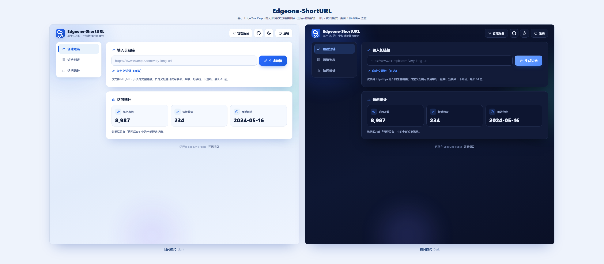

# 📦 Edgeone-ShortURL

基于 **腾讯云 EdgeOne Pages** 构建的无服务器短链接服务（URL Shortener）。支持快速创建短链接、访问统计、运行时设置与简易管理后台；全新蓝色科技风 UI，原生适配**桌面端 / 移动端**与**日间 / 夜间模式**。

> 当前版本 **v3.3.2**（变更记录见文末「更新日志」）

---

## ✨ 特性

- 🔗 **短链生成**：自动生成随机短链接，也支持自定义短链标识（slug）与**批量创建**（一次最多 20 条）。
- ⏱ **链接控制**：单条短链可设置**有效期**、**访问次数上限**与**访问密码**（密码页验证通过后 24 小时免输）。
- 📱 **二维码**：生成结果自带二维码，可一键下载 PNG；支持中心 Logo（**网站默认 Logo 或上传自定义图片**）与前景色自定义。
- 📊 **访问统计**：总览统计、近 7 天新增柱状图、访问量 TOP 排行；单条短链支持**访问详情**（近 14 天趋势 / 设备占比 / 来源 TOP5），并可开启**访问去重**防误刷。
- 🧠 **管理后台**：搜索、排序、分页加载、**行内编辑**、软删除**回收站**（可恢复 / 彻底删除）、CSV / JSON **数据导出**。
- ⚙️ **运行时设置**：口令在线修改、会话有效期、限流阈值、slug 策略、URL 去重开关、跳转方式（301/302）、域名白名单、每 IP 每日创建限额、自定义保留字——保存即时生效，无需重新部署。
- 🔑 **API Token**：长期令牌（`X-API-Token`）供脚本 / 第三方调用管理接口，仅创建时显示一次，可随时吊销。
- 🧭 **品牌化错误页**：短链不存在 / 已删除 / 已过期 / 达上限均有统一风格的引导页。
- 🎨 **现代 UI**：深科技蓝 + 青绿主题，日间 / 夜间模式（默认跟随系统、可手动切换），桌面 / 移动端响应式布局。
- 🔐 **安全设计**：口令登录 + 服务端会话、登录失败限流、保留字与协议校验、口令哈希存储与会话版本失效。
- 🚀 **无服务器架构**：基于 EdgeOne Pages Functions + KV，低延迟、零运维。
- ⚙️ **简单部署**：一键部署，无需额外服务器。

---

## 📸 预览



---

## 🧩 安装与部署

### 1. Fork 并部署到 EdgeOne Pages

1. Fork 本仓库到你的 GitHub 帐号。
2. 在 EdgeOne Pages 控制台中绑定该仓库，或点击下方按钮一键部署。
3. 完成自动构建与部署。

[](https://console.cloud.tencent.com/edgeone/pages/new?repository-url=https%3A%2F%2Fgithub.com%2FJacky088%2FEdgeone-ShortURL)（国内版）

[](https://edgeone.ai/pages/new?repository-url=https%3A%2F%2Fgithub.com%2FJacky088%2FEdgeone-ShortURL)（国际版）

### 2. 绑定 KV 存储

1. 打开 Pages 项目 → **设置 → KV 存储**，新建一个命名空间（namespace）。
2. 将绑定变量名设置为：`my_kv`（代码同时兼容 `MY_KV`，或自动扫描其它 KV 绑定）。
3. 重新部署项目。

> ⚠️ 不绑定 KV 时服务将不可用 —— 短链数据、登录会话与限流状态都存储在 KV 中。

### 3. 配置环境变量（可选）

| 变量名 | 必填 | 作用说明 |
|--------|------|----------|
| `ADMIN_PATH` | 视需要 | 管理后台路径（如 `admin123`）。未设置则无法进入管理后台 |
| `PASSWORD` | 视需要 | 访问口令（初始值）。设置后访问主页与后台均需口令；可在后台「系统设置」中在线修改覆盖 |

---

## 🗺️ 使用方法

1. 打开部署后的网站地址即进入**前台**：页面只保留「创建短链」——输入长链接生成；「自定义短链」默认展开（留空则随机生成）；「更多选项」设置有效期、次数上限、访问密码与备注；页脚固定显示版本与合作入口。
2. 若配置了 `ADMIN_PATH`，前台顶栏会出现**「管理后台」**入口，点击进入管理中心；未配置时前台不显示该入口（纯生成器形态）。
3. **批量创建**提供逐行编辑器：每行填写目标链接，可选自定义短链与备注；支持「添加一行」「从文本导入」（每行 `链接 [自定义短链] [备注]`，空格分隔）与「清空」，生成后成功行可逐条或一键全部复制，失败行就地标红并给出原因。
4. **管理后台**集中全部管理能力，侧边栏切换：
   - **短链列表**：搜索、排序、分页加载、行内编辑、回收站（恢复 / 彻底删除），并可导出 CSV / JSON。
   - **访问统计**：总访问量 / 短链总数 / 最近创建，近 7 天新增与访问量 TOP 排行；每条短链可查看近 14 天趋势、设备占比与来源 TOP5。
   - **系统设置**：在线修改访问口令、会话有效期、限流阈值、slug 策略、URL 去重、跳转方式、域名白名单、每 IP 每日创建上限、自定义保留字与二维码样式（含自定义中心 Logo），保存即时生效。

---

## 📡 API 接口说明

除会话 Cookie 外，管理类接口均支持请求头 `X-API-Token: <在后台生成的 Token>` 调用。

| 接口 | 方法 | 鉴权 | 说明 |
|------|------|------|------|
| `/api/create` | POST | 会话或 Token | 创建短链，`{ "url", "slug": "可选", "ttlDays", "maxVisits", "password", "note" }`；批量传 `{ "urls": [...] }`（最多 20 条） |
| `/api/links` | GET | Admin-Slug + 会话或 Token | 获取短链列表（含选项与聚合统计）；`?trash=1` 返回回收站 |
| `/api/update` | POST | 同上 | 编辑短链：目标链接 / 备注 / 有效期 / 次数上限 / 访问密码 |
| `/api/delete` | POST | 同上 | 删除短链（默认进入回收站）；`{ "slug", "purge": true }` 彻底删除 |
| `/api/restore` | POST | 同上 | 从回收站恢复短链 `{ "slug" }` |
| `/api/settings` | GET/POST | 同上 | 读取 / 保存运行时设置（口令修改会使所有旧会话失效） |
| `/api/token` | GET/POST/DELETE | 同上 | API Token 管理：列表 / 生成（明文仅返回一次）/ 吊销 |
| `/api/auth` | POST | - | 口令登录，请求体 `{ "password": "..." }` |
| `/api/logout` | POST | 会话 | 注销当前会话 |

示例：

```bash
# 创建短链（带有效期与次数上限）
curl -X POST https://your.domain/api/create \
  -H "Content-Type: application/json" \
  -H "X-API-Token: <your-token>" \
  -d '{"url": "https://example.com/very-long-url", "ttlDays": 7, "maxVisits": 100}'

# 批量创建
curl -X POST https://your.domain/api/create \
  -H "Content-Type: application/json" \
  -H "X-API-Token: <your-token>" \
  -d '{"urls": ["https://a.example/1", "https://b.example/2"], "note": "活动物料"}'

# 获取短链列表
curl https://your.domain/api/links -H "X-API-Token: <your-token>"
```

### KV 数据结构

| Key | 说明 |
|-----|------|
| `<slug>` | 短链数据 `{ "original", "visits", "createdAt", "note", "expiresAt", "maxVisits", "pwdHash", "deletedAt", "daily", "ref", "dev", "ipd" }` |
| `hash:<sha256(url)>` | URL 去重映射（可在设置中关闭；相同长链接自动复用同一个短链） |
| `sess:<token>` | 服务端登录会话（含过期时间与会话版本） |
| `rl:<ip>` | 登录失败按 IP 的限流计数 |
| `dc:<ip哈希>` | 每 IP 每日创建计数（设置每日上限后启用） |
| `cfg:settings` | 运行时设置（管理后台「系统设置」页读写） |
| `cfg:tokens` | API Token（仅存 SHA-256 哈希，明文不落盘） |

---

## 🔒 安全说明

- 口令使用**常量时间比较**；登录失败按 IP 限流（5 次失败锁定 10 分钟）。
- 会话采用随机 token，`HttpOnly` + `Secure` 会话级 Cookie（**关闭浏览器标签后自动失效**），服务端存储并按活跃度滑动续期兜底。
- `api`、`favicon.ico`、`hash:` / `sess:` / `rl:` 前缀及管理员路径均为保留字，不可注册为短链。
- 短链跳转仅允许 `http/https` 协议，防御 `javascript:` 等协议注入。
- 自定义短链仅允许字母、数字、短横线、下划线，防御路径遍历。

---

## 🧪 本地开发与测试

```bash
npm test    # 运行测试：utils 工具函数 + 页面模板冒烟测试（Node 18+，无第三方依赖）
```

核心代码位于 `functions/` 目录：

```
functions/
├── index.js            # 路由入口
├── [slug]/index.js     # 页面路由 / 短链跳转（有效期、密码、统计）/ 鉴权
├── pages.js            # 页面模板（登录 / 主页 / 管理后台 / 密码页 / 错误页）
├── utils.js            # 公共工具与运行时设置
└── api/                # create / links / update / delete / restore / settings / token / auth / logout
```

---

## 🛡️ 致谢

项目灵感来自 [**hobk 的 eo-short**](https://github.com/hobk/eo-short)，感谢其开源贡献。

---

## 🕘 更新日志

### v3.3.2

- 修复移动端输入框尺寸异常 / 与标题重叠：补全标准 `text-size-adjust` 禁用安卓浏览器文字自动放大，全部输入框固定高度改为 `min-height` 自适应。
- 后台移动端菜单改为 **2×2 网格**完整显示，不再横向滑动。
- 批量创建模式下隐藏「自定义短链」行（仅适用于单条创建），并在批量面板内提供独立的「生成短链」按钮。
- 「从文本导入」写明支持格式：可粘贴 txt / csv 等任意文本，或直接选择 .txt / .csv 文件导入（每行一条，空格分隔）。

### v3.3.1

- 短链列表自适应优化：短链接完整显示、原始链接随窗口宽度折叠展示。

### v3.3.0

- **批量创建重构为逐行编辑器**：每行独立填写目标链接、自定义短链与备注；支持添加一行、从文本导入（`链接 [自定义短链] [备注]`，空格分隔）、清空与逐行删除；失败行就地标红并在结果卡给出原因；成功行支持逐条复制与**一键全部复制**。
- `/api/create` 新增 `items` 批量形态（逐条 `slug` / `note`，响应带 `index` 便于按行定位），原有 `url` / `urls` 形态保持兼容。
- 「自定义短链」默认展开，留空自动随机生成。
- 页脚固定吸底（内容不足一屏时也贴底显示）；前台布局与后台一致改为宽屏自适应。

### v3.2.0

- **前台 / 后台职责重构**：前台专注「创建短链」——移除侧边栏导航与迷你统计卡，内容窄栏居中，移动端更干净；列表、统计、设置、关于全部集中于管理后台。
- 前台顶栏新增「管理后台」入口，由服务端按 `ADMIN_PATH` 是否配置**条件渲染**（未配置时不渲染，纯生成器形态无任何多余元素）。
- 主页统计拉取、深链导航与关于弹窗等冗余代码随结构移除。

### v3.1.1

- 短链列表自适应优化：**短链接完整显示**不再截断；**原始链接随窗口宽度折叠展示**（默认 240px、≥1440px 480px、≥1800px 640px，备注同步加宽），悬停始终可见完整内容。

### v3.1.0

- 二维码支持**上传自定义中心 Logo**（PNG/JPG/WebP/SVG ≤110KB，正方形推荐），一键「恢复默认 Logo」（网站图标）；上传 / 恢复即时生效，主页与后台二维码同步更新。
- **桌面大屏宽版布局**：≥1440px 显示器自动加宽内容区（最高 1760px），短链列表 / 统计 / 设置显示更多内容。
- 新增设置接口 Logo 校验测试。

### v3.0.2

- 修复弹窗内按钮被拉伸时文字不居中的问题（统一 `justify-content`）。
- 全部弹窗默认宽屏化：确认 / 编辑 / 二维码弹窗 520px，访问详情 760px；修复编辑弹窗日期控件溢出出现的横向滚动条。
- 移动端 / 桌面端弹窗适配复查。

### v3.0.1

- 修复「访问统计」视图卡片与图表区贴边重叠的布局问题。
- 管理后台新增**二维码查看**：列表行内入口，弹窗展示并可下载 PNG（样式跟随运行时设置）。
- 「访问详情」弹窗改为**横版宽布局**：概览三卡一行、14 天趋势通栏、设备与来源双列；移动端自动收窄并优化图表标签。
- 全面复查移动端 / 桌面端适配（弹窗宽度、图表标签、设置页与表格布局）。

### v3.0.0

- 新增 **运行时设置**：口令在线修改（旧会话立即失效）、会话有效期、限流阈值、slug 长度 / 字符集、URL 去重开关、默认跳转方式（301/302）、目标域名白名单、每 IP 每日创建上限、自定义保留字、二维码样式，保存即时生效。
- 新增 **链接控制**：单条短链有效期、访问次数上限、访问密码保护。
- 新增 **批量创建**：一次最多 20 条，统一套用创建选项。
- 新增 **访问详情**：单条短链近 14 天访问趋势、设备占比、来源 TOP5；可选访问去重防误刷。
- 新增 **回收站**：删除先进回收站，可恢复或彻底删除。
- 新增 **行内编辑**：目标链接、备注、有效期、次数上限、访问密码。
- 新增 **API Token**：长期令牌调用管理接口，可随时吊销。
- 新增 **数据导出**：CSV / JSON。
- 品牌化错误页细化：已删除 / 已过期 / 达上限各有明确提示。

### v2.1.0

- 「关于项目」栏目、登录口令可见性切换、访问统计迁移、深链直达、列表分页与搜索、二维码下载、日间 / 夜间模式。

---

## 📃 License

本项目使用 **MIT License**。

---

如果这个项目对你有帮助，欢迎在 GitHub 上点一个 ⭐ 支持作者！
