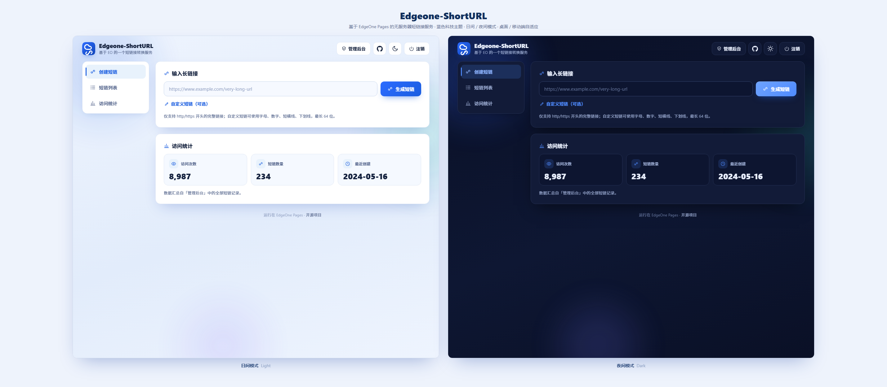

# 📦 Edgeone-ShortURL

基于 **腾讯云 EdgeOne Pages** 的无服务器短链接服务：创建 / 统计 / 管理后台 / 日间夜间主题，桌面与移动端自适应。

> 当前版本 **v3.6.0**

---

## ✨ 特性

- 🔗 **短链生成**：随机或自定义 slug，**批量一次 20 条**（逐行编辑 / 文本导入 / 一键复制）。
- ⏱ **链接控制**：有效期、访问次数上限、访问密码（验证后 24 小时免输；密码试错限流：10 次错误 / 10 分钟）。
- 📱 **二维码**：结果自带二维码，可下载 PNG；支持中心 Logo（默认或自定义）与前景色。
- 📊 **访问统计**：总量 / 近 7 天新增 / 全站近 14 天访问趋势 / TOP 排行；单链近 14 天趋势、设备占比、来源 TOP5，可选去重防刷。
- 🧠 **管理后台**：搜索（含备注）、状态筛选、多选批量操作、排序、分页、行内编辑、回收站（恢复 / 彻底删除，支持批量）、CSV / JSON 导出。
- ⚙️ **运行时设置**：口令、会话时长、限流、slug 策略、去重、跳转 301/302、白名单、每日限额、保留字、统计日界时区偏移，保存即生效。
- 🔑 **API Token**：`X-API-Token` 调用全部管理接口，仅创建时显示一次，可吊销。

---

## 📸 预览



---

## 🧩 安装与部署

1. Fork 本仓库，在 EdgeOne Pages 控制台绑定该仓库（或点下方一键部署）。

   [](https://console.cloud.tencent.com/edgeone/pages/new?repository-url=https%3A%2F%2Fgithub.com%2FJacky088%2FEdgeone-ShortURL)（国内版）

   [](https://edgeone.ai/pages/new?repository-url=https%3A%2F%2Fgithub.com%2FJacky088%2FEdgeone-ShortURL)（国际版）
1. Pages 项目 → **设置 → KV 存储**新建命名空间，绑定变量名 `my_kv`（兼容 `MY_KV`），重新部署。
1. 可选环境变量：`ADMIN_PATH`（后台路径，未设则无后台入口）、`PASSWORD`（访问口令，可在后台在线修改覆盖）。

> ⚠️ 不绑定 KV 服务不可用（短链 / 会话 / 限流都存在 KV）。

---

## 🗺️ 使用方法

- **前台**：输长链接生成；自定义短链留空则随机；「更多选项」设有效期、次数上限、访问密码、备注。
- **批量**：每行 `链接 [自定义短链] [备注]`，空格分隔；支持添加行、文本 / .txt / .csv 导入。
- **后台**（需 `ADMIN_PATH`）：短链列表、访问统计、系统设置；`?view=list|stats|settings` 可直达视图。

---

## 📡 API 接口说明

管理接口支持请求头 `X-API-Token: <后台生成的 Token>` 调用。

| 接口 | 方法 | 鉴权 | 说明 |
|------|------|------|------|
| `/api/create` | POST | 会话或 Token | 建链 `{ "url", "slug", "ttlDays", "maxVisits", "password", "note" }`；批量 `{ "urls": [...] }`（≤20 条）；30 次/分钟限流（429 带 `Retry-After`） |
| `/api/links` | GET | 会话（需 `X-Admin-Slug` 头）或 Token | 列表（瘦身字段）；`?trash=1` 回收站；`?detail=1` 统计；`?slug=xxx` 单条详情；`?limit&cursor` 分页；超 2000 条 `{ links, truncated: true }` |
| `/api/stats` | GET | 同上 | 全站聚合：近 N 天访问趋势（`?days=`，默认 14，最大 30）、准确总访问 / 短链数 / 最近创建（排除回收站） |
| `/api/update` | POST | 同上 | 编辑目标链接 / 备注 / 有效期 / 次数上限 / 访问密码 |
| `/api/delete` | POST | 同上 | 软删除；`{ "slug", "purge": true }` 彻底删除；批量 `{ "slugs": [...], "purge" }`（≤100 条，逐条返回 `results`） |
| `/api/restore` | POST | 同上 | 从回收站恢复 `{ "slug" }`；批量 `{ "slugs": [...] }`（≤100 条） |
| `/api/settings` | GET/POST | 同上 | 读写运行时设置（改口令致旧会话失效） |
| `/api/usage` | GET/POST | 同上 | 存储用量精确统计：GET 读缓存（未统计返回 `scannedAt: 0`）；POST 全量扫描键与短链值（活跃/回收站计数、键+值字节），结果缓存 `cfg:usage`，超 2 万键标记 `partial` |
| `/api/token` | GET/POST/DELETE | 同上 | Token 列表 / 生成（明文仅一次）/ 吊销 |
| `/api/auth` | POST | - | 口令登录 `{ "password" }` |
| `/api/logout` | POST | 会话 | 注销当前会话 |

```bash
# 创建短链
curl -X POST https://your.domain/api/create \
  -H "Content-Type: application/json" -H "X-API-Token: <token>" \
  -d '{"url": "https://example.com/very-long-url", "ttlDays": 7, "maxVisits": 100}'

# 获取列表
curl https://your.domain/api/links -H "X-API-Token: <token>"
```

### KV 数据结构

| Key | 说明 |
|-----|------|
| `<slug>` | 短链 `{ "original", "visits", "createdAt", "note", "expiresAt", "maxVisits", "pwdHash", "deletedAt", "daily", "ref", "dev", "ipd" }` |
| `hash:<sha256(url)>` | URL 去重映射（可关闭） |
| `sess:<token>` | 登录会话（含过期时间与会话版本） |
| `rl:<窗口桶>:<ip哈希>` | 登录失败限流计数（按锁定窗口分桶：默认 5 次 / 10 分钟，窗口滚动自动清理） |
| `rlp:<窗口桶>:<ip+slug 哈希>` | 密码保护短链的试错限流计数（10 次错误 / 10 分钟，历史桶自动清理） |
| `crl:<分钟桶>:<调用方哈希>` | 创建接口分钟级限流（30 次/分钟，历史桶自动清理） |
| `dc:<日期桶>:<ip哈希>` | 每 IP 每日创建计数（设上限后启用，昨日桶自动清理） |
| `cfg:settings` | 运行时设置 |
| `cfg:tokens` | API Token（仅存哈希） |

---

## 🔒 安全说明

- 客户端 IP 优先取 EdgeOne 注入的 `EO-Client-IP`，XFF 只取最右一段：伪造 `X-Forwarded-For` 左侧无法绕过限流与去重。
- 口令**常量时间比较**；登录失败按 IP 限流（默认 5 次锁定 10 分钟，429 带 `Retry-After`）。
- 会话为随机 token，`HttpOnly` + `Secure` 会话级 Cookie，服务端存储 + 滑动续期；改口令致旧会话失效。
- 跳转仅 `http/https`；slug 仅字母数字、`-`、`_`；`api` / `favicon.ico` / `hash:` / `sess:` / `rl:` / `crl:` / `cfg:` / `dc:` 及管理路径为保留字。
- HTML 响应带 CSP（禁 object/embed、独立文档基址与被框嵌）、`nosniff`、`no-referrer`、`X-Frame-Options: DENY`。
- 创建接口的去重命中只回瘦身字段：聚合统计与密码哈希不会经创建响应泄露。
- **管理员预览不计数**：携带有效管理会话 Cookie 的短链点击不计入访问统计（避免管理员自查污染数据）；访客请求无 Cookie，跳转热路径零额外开销；密码保护链接的管理员预览仍需密码。

---

## ⚠️ 已知限制

- **并发计数**：访问计数为「读-改-写」写回 KV，EdgeOne KV 无原子自增；同一热门短链被高并发访问时可能少计（低流量下影响可忽略）。
- **301 缓存**：跳转码设为 301 后浏览器会缓存跳转，后续访问不再经过函数、不计数。建议保持默认 302；301 仅用于确定永久跳转的场景。
- **限流精度**：分钟级限流为「读后写」，高并发下同一窗口可能略微超出阈值（KV 模型下的已知折衷）。
- **KV 无 TTL**：EdgeOne KV 不支持过期删除；会话过期靠鉴权时惰性清理，限流键已改为时间桶并在使用时清理历史桶。

---

## 🧪 本地开发与测试

```bash
npm test    # Node 18+，无第三方依赖
```

```
functions/           # 页面路由 / 短链跳转 / 鉴权（[slug]/index.js）
├── pages.js         # 页面模板（样式与公共脚本走 public/ 静态文件）
├── utils.js         # 公共工具与运行时设置（含 settings 短缓存）
├── static-assets.js # 自动生成的静态资源兜底（勿手工编辑，由 gen-assets.mjs 同步）
└── api/             # create / links / stats / update / delete / restore / settings / token / auth / logout
public/              # app.css / ui.js / qr-lib.js / qr-draw.js（可缓存静态资源）
scripts/             # gen-assets.mjs（同步兜底）/ local-serve.mjs / verify-local.mjs
```

> 改 `public/` 后：`node scripts/gen-assets.mjs` 同步 `functions/static-assets.js`，再 bump `pages.js` 顶部 `ASSET_VERSION`。

---

## 🛡️ 致谢

灵感来自 [**hobk 的 eo-short**](https://github.com/hobk/eo-short)，感谢开源贡献。

---

## 📃 License

本项目使用 **MIT License**。

---

如果这个项目对你有帮助，欢迎在 GitHub 上点一个 ⭐ 支持作者！
